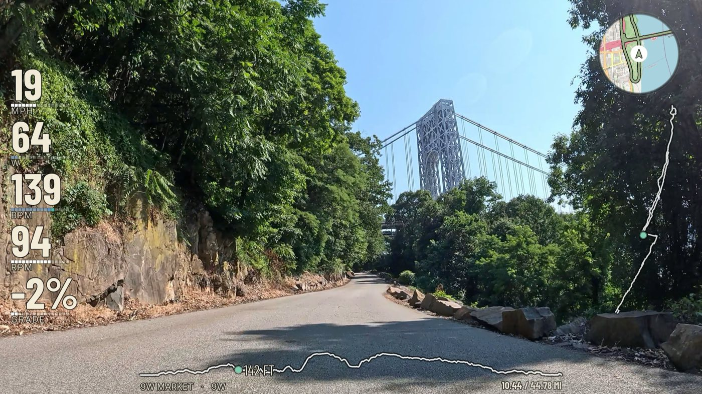
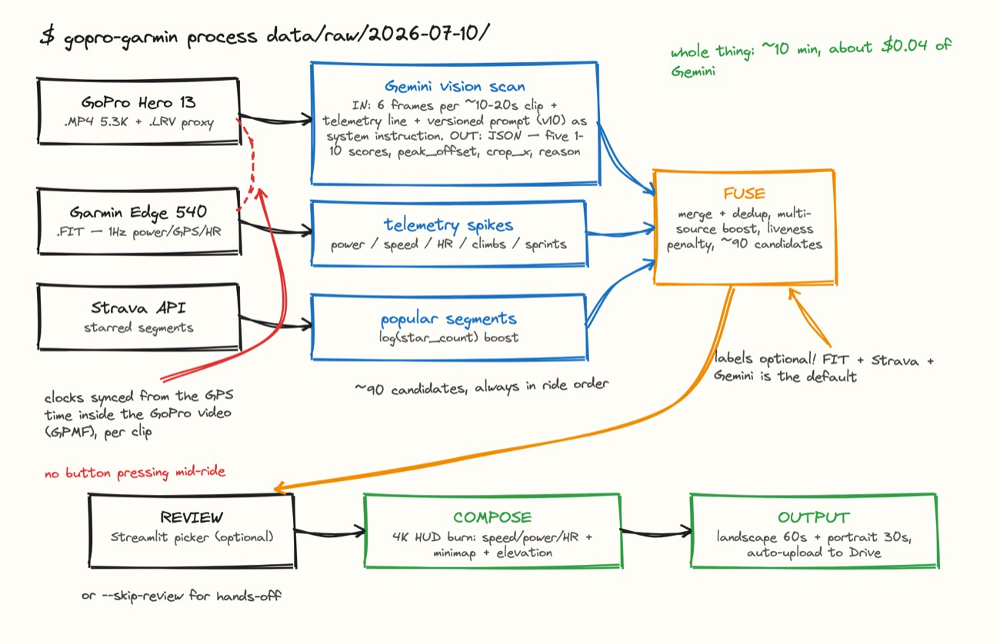
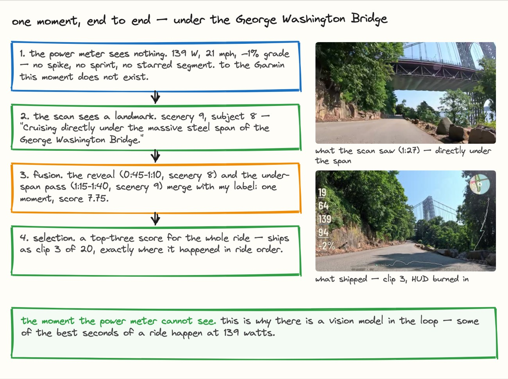
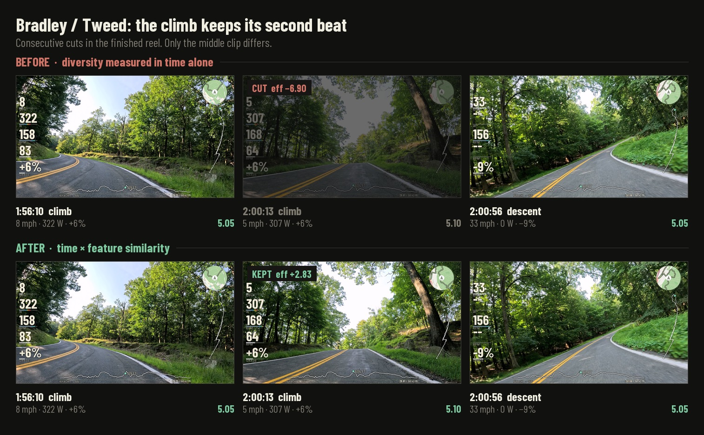
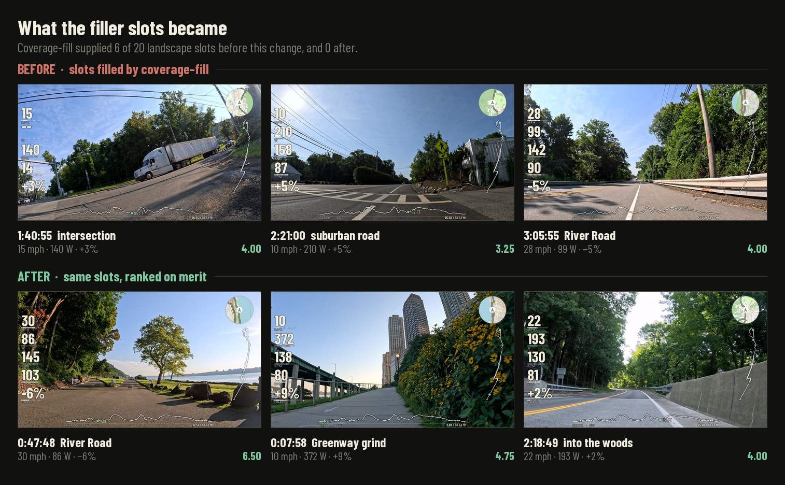
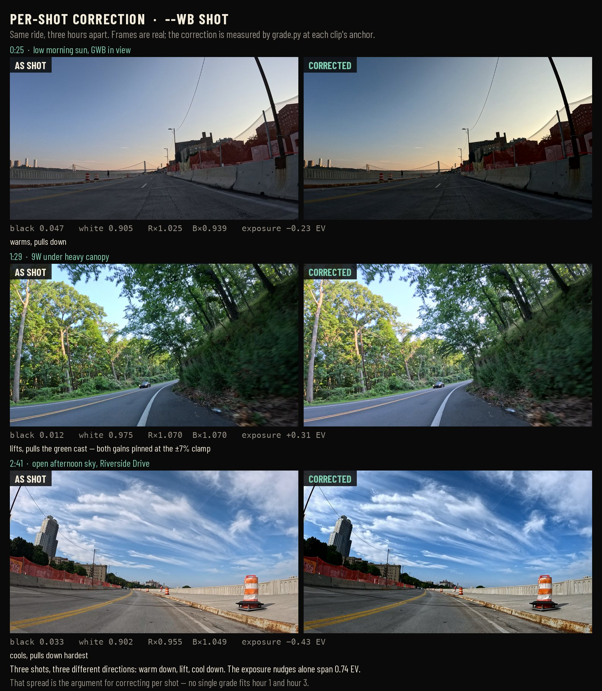
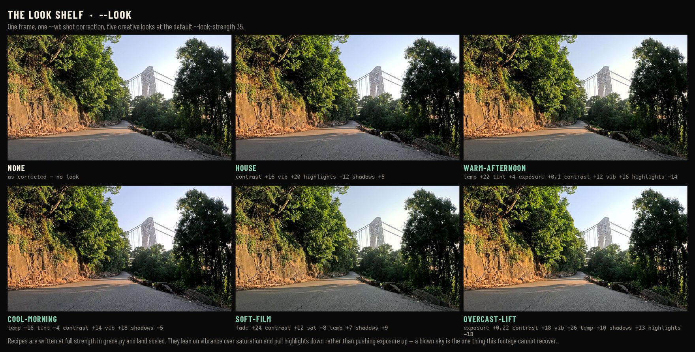
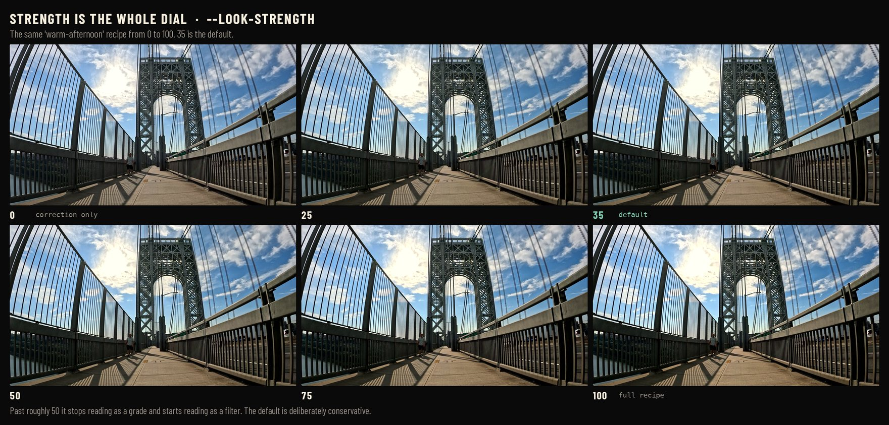

# ride-recap

**TL;DR:** Turn hours of raw GoPro footage + a `.fit` file into a 60-second highlight reel with ride telemetry burned in. Every second of the ride is ranked and edited by a LLM. The whole thing costs about $0.04 per ride and takes 10 minutes.

*Alternate **TL;DR:** How I managed to turn 3 hours of boring GoPro footage into 30 seconds of boring GoPro footage.*



## Summary

I ride most weekends, usually out of Manhattan and up 9W. By the end of a ride I have hours of GoPro footage and one `.fit` file with per-second speed, power, heart rate, cadence, and GPS. Absolutely no one wants to watch 3 hours of being stuck behind Citibikes on West Side Highway. It's fun to look through past footage, identify the fun parts, and put together a narrative to remember. But since cycling is already time consuming, manually editing a highlight reel edit per ride is a nonstarter. So I built and open-sourced this repo.

One command, about ten minutes, roughly four cents of `gemini-3.5-flash`:

```bash
ride-recap process data/raw/2026-07-10/
```

The outputs: `highlight_landscape.mp4` (60s, 16:9) and `highlight_portrait.mp4` (30s, 9:16). The clips are always in ride order with telemetry burned in.

**▶ Click the image below to watch a finished highlight** (River Road to 9W Market):

[](https://www.youtube.com/watch?v=ZBrneOOYmG0)

Here's my long write-up of how it works and everything I got wrong building it: **[Teaching LLMs Taste](https://iandmacomber.com/blog/gopro-garmin-gemini-ride-recap)**.

---

## The Architecture



We identify compelling moments from four separate sources:

1. Garmin telemetry via `.fit` file (speed, HR, power spikes, sprints, climbs)
2. Strava via API (popular segments)
3. Configured vision-model scan + rating of individual frames
4. (optional) hand-labels via Streamlit app

Here's an example of one moment being scored across all sources:


  
The fusion step works like this:

1. “Must include” manual labels are picked first
2. A model narrative pass picks 20 clips to best tell the story of the ride, boosting “cross-source agreements” (if a human label + telemetry + Strava + vision all agree that a clip is interesting)
3. Greedy re-ranking with a redundancy penalty, so a clip that repeats one already picked gets pushed down — [measured on time × feature similarity](#picking-clips-that-arent-the-same-clip), not ride time alone
   1. First, a “quality” phase that picks best-first until the best remaining candidate is net-negative
   2. Second, a “coverage” fill that guarantees the exact clip count, using the same ranking with coverage weighted higher — so the biggest timeline holes win, but score and redundancy still count.

Generally, the visual rubric is the score of record, and telemetry is a tiebreaker.

---

## Setup

**You need:** Python 3.11+, [ffmpeg](https://ffmpeg.org/download.html), and
one configured vision-model provider. You also need a road bike mounted with a
GoPro and a Garmin.

```bash
git clone https://github.com/ianmacomber/ride-recap.git
cd ride-recap
python -m venv .venv && source .venv/bin/activate
pip install -e ".[dev]"

# macOS: brew install ffmpeg     Debian/Ubuntu: sudo apt install ffmpeg

cp .env.example .env
```

Gemini is the default provider. To use it, open `.env` and set:

```env
GEMINI_API_KEY=your-key-here    # https://aistudio.google.com/apikey

FTP=240                          # ← YOUR functional threshold power
MAX_HEART_RATE=196               # ← YOUR max heart rate
```

**Set FTP and MAX_HEART_RATE regardless of provider.** These numbers drive
three things: the spike thresholds that decide what counts as a hard effort,
the HUD's zone colors, and the power zones written into the vision prompt so
the model knows whether 216W means "cruising" or "peak effort" for you.

Verify it runs:

```bash
ride-recap --help
pytest                    # smoke tests, no video or API keys needed
```

### Model providers

Gemini remains the default. A complete run uses one provider for the vision
scan, narrative selection, and prompt evaluation; caches and comparison
reports are isolated by provider and model.

For OpenAI:

```env
MODEL_PROVIDER=openai
OPENAI_API_KEY=your-key-here
OPENAI_MODEL=gpt-4.1-mini
```

For a local OpenAI-compatible VLM:

```env
MODEL_PROVIDER=local
LOCAL_BASE_URL=http://127.0.0.1:8080/v1
LOCAL_API_KEY=local
LOCAL_MODEL=mlx-community/Qwen3-VL-8B-Instruct-3bit
LOCAL_MAX_CONCURRENCY=1
LOCAL_TIMEOUT_SECONDS=600
```

One way to serve that model on Apple Silicon is
[`mlx-vlm`](https://github.com/Blaizzy/mlx-vlm):

```bash
python -m pip install -U mlx-vlm
python -m mlx_vlm.server \
  --model mlx-community/Qwen3-VL-8B-Instruct-3bit \
  --host 127.0.0.1 \
  --port 8080
```

Keep the server running and confirm it is ready before starting a scan:

```bash
curl http://127.0.0.1:8080/health
curl http://127.0.0.1:8080/v1/models
```

The default local concurrency is deliberately one. The scanner evaluates
multiple chapters and regions concurrently, while a single Apple Silicon VLM
usually needs requests serialized to avoid memory pressure.

---

## Your first ride

Put everything for one ride in a single date folder — GoPro `.MP4`s and the Garmin `.fit` together:

```
data/raw/2026-07-10/
├── GX010123.MP4
├── GX010124.MP4
├── GL010123.LRV     ← copy these too, see below
├── GL010124.LRV
└── ride.fit
```

The FIT comes off the Edge over USB, or `ride-recap garmin-download --date 2026-07-10 --output-dir data/raw/2026-07-10`.

**Copy the `.LRV` files off the SD card.** GoPro already writes an 848×480 H.264 proxy next to every recording. The scan downscales to 480px anyway, so the proxy is exactly the resolution needed and decodes 10-20x faster — frame extraction drops from ~25 minutes to ~30 seconds. The pipeline auto-detects them and still burns from the full-res `.MP4`. Look for the artifact the hardware already produces before optimizing the computation.

Then:

```bash
ride-recap process data/raw/2026-07-10/
```

It'll ask five questions (start, destination, road, a saying, who you rode with, all with GPS-derived defaults, just hit Enter), sync the clocks, scan the footage, and open a Streamlit reviewer at `:8501` with 5-second preview clips.

**`process` stops at the reviewer.** Pick your clips, then run the command it prints:

```bash
ride-recap compose-selected data/raw/2026-07-10/selected_candidates.json \
    data/raw/2026-07-10 data/raw/2026-07-10/ride.fit
```

Or skip the human entirely:

```bash
ride-recap process data/raw/2026-07-10/ --skip-review
```

That command runs end to end. The autonomous output is usually good.

---

## No GoPro? Use mine

[`samples/2026-07-10/`](samples/README.md) is a real ride — 44.7 miles up 9W
and back — with my hand labels, the Gemini baseline ratings, and the sync
sidecars committed right here. That's enough to reproduce the scoring
comparison without downloading any video or holding a Gemini key. The footage
itself lives on Hugging Face as
[`iandmacomber/ride-recap-sample-2026-07-10`](https://huggingface.co/datasets/iandmacomber/ride-recap-sample-2026-07-10),
tiered so you can pull 1 MB, 6 GB, or the whole 14 GB depending on what you're
testing:

```bash
pip install huggingface_hub
hf download iandmacomber/ride-recap-sample-2026-07-10 --repo-type dataset \
    --include "clips/*" "sidecars/*" --local-dir hf_ride
```

That's the 6 GB tier — the 8 chapters my hand labels reference, which is the
one issue #2 needs. Swap `clips` for `full` for the whole ride. The
[samples README](samples/README.md) has the couple of `mv` commands that turn
the download into a `data/raw/2026-07-10/` folder every command above runs
against verbatim.

See [the issue #2 model comparison](docs/model-comparison.md) for the
Gemini, GPT-4.1 mini, and local Qwen3-VL results on these same eight chapters.

---

## Degrading gracefully

Only ffmpeg, a FIT file, and at least one `.MP4` are actually required. Everything else turns itself off politely:

| Missing | What happens |
|---|---|
| Active provider credentials/server | Prints a warning or a clear connection error; without a working vision provider, candidates fall back to telemetry + Strava and greedy selection. |
| Strava credentials | Only runs if you pass `--strava-activity` anyway. Warns and continues. |
| Garmin credentials | Only needed for `garmin-download`. `process` never touches them. |
| `OSM_CONTACT_EMAIL` | No GPS-derived place names; falls back to your `--origin`/`--road` flags or the design tokens. |
| rclone | Skips the Drive upload. Files stay in `<date>/highlights/`. |
| `.LRV` proxies | Falls back to the `.MP4` with keyframe-only decode. Slower, same result. |
| Labels | Fully optional. This is the default mode. |
| ffmpeg | Hard stop, up front, with install instructions. |

---

## Picking clips that aren't the same clip

A highlight reel needs variety, so the selector penalises a candidate that sits
near one already chosen. The obvious way to measure "near" is ride time, and
that is what this did for a long time:

```
eff = score − λ · Σ exp(−Δt / τ),   τ = candidate_span / n_slots
```

On a four-hour ride τ works out to about 12 minutes, so anything within a dozen
minutes of an existing pick reads as crowded — whatever it actually shows.

For cycling that is exactly backwards. You grind up a climb at 5 mph and 307 W,
crest it, and are doing 33 mph at zero watts forty seconds later. Adjacent in
time; opposite in every other axis; the best pair of clips on the ride.

Diversity is now measured on **time × feature similarity**:

```
redundancy = exp(−Δt / 120s) · (0.65 · kin_sim + 0.35 · vis_sim)
```

`kin_sim` compares speed, power and gradient, each normalised by the spread that
reads as a different kind of riding. `vis_sim` compares the vision model's five
rubric axes. Two clips suppress each other only when they are close **and**
alike, so the metric separates a climb from the descent off its summit
(`kin_sim` 0.017) while still recognising two grinds up the same hill as the
same thing (`kin_sim` 0.772).



That middle clip is the whole change. It is not one of my labels — it competed
on merit and lost, because sitting 43 seconds from an already-picked descent
drove its effective score to −6.90. It now scores +2.83 and the reel plays the
climb twice before it drops.

The same fix removed a separate problem. Coverage-fill — the stage that tops the
reel up to its slot count — used to rank purely by `nearest_gap + 30 · score`,
with no crowding check at all, which let a 3.25 clip in a big hole beat a 6.50
anywhere else. It now runs the same scoring function as the quality phase and
differs only in how heavily coverage is weighted. On the ride below it supplied
6 of 20 landscape slots before the change and 0 after:



Across that reel — 90 candidates, 20 slots — mean clip score went 5.25 → 5.51,
clips scoring under 4.0 went 2 → 1, and four of the twenty clips changed.

```bash
ride-recap process <date-folder>                        # default, 1.5
ride-recap process <date-folder> --coverage-weight 0    # best clips, gaps allowed
ride-recap process <date-folder> --coverage-weight 2    # span the whole ride
```

**`--coverage-weight`** is the dial, and the trade it makes is real. At `0` the
selector chases the best clips wherever they are and will happily leave an hour
of the ride unrepresented; at `2` it spans the whole ride even when that means
weaker footage. The default is `1.5`. On a ride where you filmed 82 minutes out
of four hours, buying back coverage means buying mediocre clips — there is no
setting that invents good footage for the stretch where the camera was off.

Not every ride can be compared this way. If a FIT carries no altitude there is
no gradient to compare, and a gap over a clip's anchor leaves it with no
telemetry at all; those pairs fall back to the ride-span time decay this used
before — the old behaviour exactly, not an approximation of it. A ride with no
power meter is fine: power reads as 0 W on both sides of every comparison,
which is correct, since two clips that both lack power should not look
*dissimilar* over it. A candidate the vision model never scored is fine too —
that only makes `vis_sim` neutral, and the telemetry still does its work.

### Two clips of one bridge, back to back

There is one repeat the redundancy term cannot catch, because it is a property
of the *sequence* rather than of any clip on its own. Redundancy is multiplied
by `exp(−Δt / 120s)`, so a pair far enough apart in time is forgiven no matter
how identical it looks. Cross the George Washington Bridge over three minutes
and you get two clips that are minutes and a kilometre apart, score well
independently, and play back to back as the same shot twice. Going over the GWB
is just going over the GWB; it looks the same anywhere on it.

So after selection, the chronologically ordered reel gets one repair pass. Two
consecutive cuts are a duplicate when they **name the same landmark** — proper
nouns pulled out of the vision model's own note, since the scan prompt does not
emit a structured place field — **and** their rubrics are near-identical
(`vis_sim` > 0.85). Extraction errs toward missing a landmark rather than
inventing one: a lone capitalised word opening a sentence is not treated as a
place, because "Ends at the pier" and "Palisades overlook" are the same shape
and only one of them is a landmark. Missing one lets a repeat through; inventing
one drops a clip that belonged in the reel. Both halves are needed. The landmark alone would suppress
the Palisades and River Road pairs, which share a road and are genuinely
different shots of it; on the reel this was tuned against, the bridge pair
scored 0.914 while those two scored 0.743 and 0.789. The rubric is what
distinguishes a uniform place from a varied one, so no per-landmark
classification is needed.

The later clip of an offending pair is swapped for the best remaining candidate
that introduces no new adjacency — but only one that clears the quality floor
the rest of the reel already meets. Once 20 clips are picked from 90 what is
left is mostly filler, and trading a strong repeat for a weak unique shot swaps
one visible flaw for another. When nothing good enough is available the repeat
is dropped instead and the reel runs one clip short. A clip you marked **must
include** in the labeler is never the one removed.

---

## Tuning it to your eye

**`src/gopro_garmin_pipeline/prompts/gemini_scan/v10.md`** is the most important file in the repo. It's the system instruction for the vision scan: a five-dimension rubric (light, composition, motion, scenery, subject, each 1–10) with anchored examples and a set of named rules. Each rule is traceable to a specific clip that Gemini skipped and I loved, or Gemini included and I hated. My taste is legislated in there: the openness gate exists because a rail-trail tunnel scored 7.2 and I think tunnels look like being stuck in a concrete tube. **You may disagree.** If your taste is different, write `v11.md`.

Prompts are immutable and versioned: never edit v10, write v11. The version string is baked into the scan's cache key, so a bump invalidates exactly the affected results and nothing else. Frontmatter requires a rationale explaining what failure prompted the version.

**`src/gopro_garmin_pipeline/design/tokens.json`** owns the design: colors, fonts, and the lockup defaults. Rebrand there, not in the drawing code.

**`src/gopro_garmin_pipeline/intro_styles.py`** owns the first two seconds. The reel opens on a title card while the footage resolves out of a `signal` reveal — a per-block mosaic and an RGB split converging into register. Four others ship (`mosaic`, `scan`, `punch`, and the original `blur`); swap with `--intro-style`, or add your own as one entry in the registry. The reveal length is deliberately separate from the title-card window: the lockup can hold as long as you like over *sharp* footage, but obscured footage past ~2s is where viewers swipe.

If you want to teach it your taste systematically: label a ride, scan it, diff your ratings against the model's, change the prompt.

```bash
ride-recap extract-frames <fit> <dir>   # once per ride, ~2 min
ride-recap label <fit> <dir> --offset <secs>
ride-recap compare <date-folder>        # your labels vs the scan
ride-recap eval-prompt <folder>...      # feeds the diff back for suggestions
```

This is basically coaching a video intern by showing them the cuts you didn't like.

---

## Color grading (optional)

Off by default — the reel ships as-shot unless you opt in. If you lock white
balance on the camera (e.g. 5500K on a GoPro — the right way to shoot for a
graded cut), the pipeline can do the balancing afterward, per shot:

```bash
ride-recap process <date-folder> --wb shot                     # correction only
ride-recap process <date-folder> --wb shot --look house        # + a shared look
ride-recap compose-selected <sel> <dir> <fit> --wb shot --look warm-afternoon --look-strength 50
```

`--wb shot` measures each selected clip around its anchor (median of three
frames) and neutralises it: a gentle levels stretch, white balance measured on
near-neutral pixels only (asphalt, concrete, cloud — not a wall of canopy),
and an exposure nudge applied as midtone gamma so highlights never clip. Light
changes over a multi-hour ride, so the correction is per-shot — there is no
single grade that fits hour 1 and hour 4.

Which is easier to believe when you watch it disagree with itself:



Three shots, three hours apart, three different answers. The morning frame gets
warmed and pulled *down*; the canopy frame gets lifted and has its green cast
pulled out — both white-balance gains pinned at the ±7% clamp, which is the
clamp doing exactly the job the comment in `grade.py` says it does; the
afternoon frame gets cooled and pulled down hardest. The exposure nudges alone
span 0.74 EV. Any single ride-wide grade has to be wrong for two of these.

`--look` layers one shared creative recipe over every clip (`house`,
`warm-afternoon`, `cool-morning`, `soft-film`, `overcast-lift`), scaled by
`--look-strength`. Looks live in `grade.py` as small dicts — add your own.
They lean on vibrance over saturation and pull highlights down rather than
exposure up, because a blown sky is the one thing this footage cannot recover.



`--look-strength` is the dial that matters more than the recipe. Past roughly
50 it stops reading as a grade and starts reading as a filter, which is why the
default is a conservative 35:



The grade is applied to the footage *before* the HUD composites, so the
overlay's white-with-black-stroke stays untouched.

Every frame above is a real frame from the [sample ride](samples/), graded by
the same `measure_shot` → `build_filter` path `process` uses — no mockups, and
the measured numbers are printed under each pair so you can check them. Pull
the video from Hugging Face and `python tools/make_grade_figures.py <dir>`
rebuilds all three, so if you change a look in `grade.py` the README stops
lying about it.

---

## Commands

```bash
ride-recap process <date-folder>            # the main one
ride-recap process <date-folder> --skip-review

ride-recap compose <video-dir> <fit>        # compose without the reviewer
ride-recap compose-selected <sel> <dir> <fit>
ride-recap review-candidates <video-dir> <fit>
ride-recap review <video> <fit>             # single-clip overlay preview (Flask)
ride-recap burn <video> <fit> -o out.mp4    # overlay a single clip

ride-recap inspect-fit <fit>                # ride stats, no video needed
ride-recap find-highlights <fit>            # telemetry highlights only
ride-recap garmin-download --date 2026-07-10
ride-recap strava-segments <activity-id>
```

`gopro-garmin` works as an alias for `ride-recap` everywhere (it's the original name, still used in the [write-up](https://iandmacomber.com/blog/gopro-garmin-gemini-ride-recap) and its figures).

---

## Layout

```
src/gopro_garmin_pipeline/
  cli.py              # Click CLI — every command above
  fit_parser.py       # .fit → RideData (power, HR, speed, GPS)
  gpmf_sync.py        # GoPro GPS-time → FIT offset. The clock sync that matters.
  gemini_scan.py      # Two-pass vision scan (coarse regions → fine rubric)
  models/             # Gemini, OpenAI, and local OpenAI-compatible adapters
  composer.py         # Candidate generation, fusion, selection, composition
  burn_overlay.py     # The 5-element HUD, landscape + portrait
  grade.py            # Optional per-shot correction + shared looks (--wb / --look)
  intro_outro.py      # Opening title card, outro recap card
  intro_styles.py     # Opening reveal treatments (signal / mosaic / scan / …)
  route_metadata.py   # Start / Far / Road from GPS via OSM + Overpass
  highlights.py       # Telemetry spike detection
  strava.py           # Segment efforts + star counts
  candidate_review.py # Streamlit reviewer
  labeler.py          # Streamlit labeler (ground truth for prompt work)
  web/                # Flask single-clip overlay preview (review)
  design/tokens.json  # All color, type, and lockup tokens
  prompts/            # Versioned, immutable LLM prompts (ship with the package)
  assets/fonts/       # Bundled OFL faces (ship with the package)
tests/                # Smoke tests
```

---

## Caveats

* **Built for one setup**: GoPro Hero 13 + Garmin Edge 540 + road cycling. Other cameras and head units should work (GPMF sync reads the standard telemetry track), but are untested.
* **I only tested on macOS**: should work for Windows and Linux but I haven't fully tested yet.
* **The learned ranker is WIP.** `learned_ranker.py` logs training data on every compose and will fit a logistic regression at ~100 examples. I never reached the threshold before the feature schema went stale. It's honest to call it unfinished.
* Video and FIT files are gitignored.

## License

MIT — see [LICENSE](LICENSE). Bundled fonts (Barlow Condensed, Inter) are SIL OFL 1.1; see [src/gopro_garmin_pipeline/assets/fonts/OFL.txt](src/gopro_garmin_pipeline/assets/fonts/OFL.txt).

Contributions welcome, but this is a personal project I use most weekends and I have a real job. If you fork it and make it yours, tell me! I'd love to see your reel.
